# Event Planner ნაწილი I


## I - რას გავაკეთებთ?
ჩვენ ავაწყობთ მობაილურის აპლიკაციას, რომელიც მომხარებელს საშვალებას მისცემს, დაგეგმოს და გაუზიაროს სხვადასხვა აქტივობები აპლიკაციის სხვა მომხმარებლებს. ქვევით მოცემულია აპლიკაციის ზოგადი სტრუქტურა:

RegisterScreen - მომხარებლის რეგისტრაცია.

LoginScreen - მომხმარებლის აუტორიზაცია.

HomeScreen - აქტივობების ჩამონათვალი და ახალი აქტივობის დაგეგმვის შესაძლებლობა.

AddEventScreen - ახალი აქტივობის დაგეგმვა.

UserScreen - მომხმარებლის პირადი აქტივობების მენეჯმენტი.

დასაწყისისთვის შექმენი პროექტი Flutlub_ზე და დაარქვი შენთვის სასურველი სახელი.

## II - ვქმნით აპლიკაციის ზოგად სტრუქტურას

ახლა მოდით შევქმნათ პროექტის ზოგადი სტრუქტურა: შევმნათ საჭირო ფოლდერები და ფაილები, რომლებიც დაგვეხმარება ჩვენი კოდის სტანდარტების მიხედვით დაყოფაში.

პირველ რიგში შექმენი სურათზე მოცემული ფოლდერები და ფაილები შენი პროექტის lib ფოლდერში:

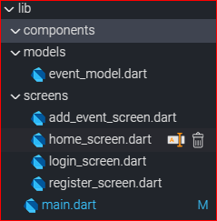

## III - Connecting to Firebase

სანამ ვიჯეტების აწყობას დავიწყებდეთ მოდით შევქმნათ Firebase_ის პროექტი, ჩავრთოთ აუთენთიფიკაციისა და Firestore_ის სერვისები და დავუკავშიროთ ჩვენ Flutter_ის აპლიკაციას.

პირველ რიგში გადადი შენი ექაუნთის Firebase console_ში და შექმენი ახალი პროექტი Create a project ღილაკის დახმარებით 

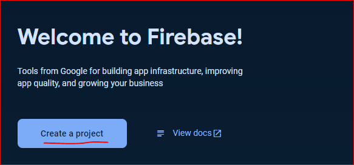

შეურჩიე შენს პროექტს სახელი (შეგიძლია იგივე სახელი გამოიყენო რაც აპლიკაციას დაარქვი) და გადადი შემდეგ ეტაპზე continue ღილაკის დახმარებით.

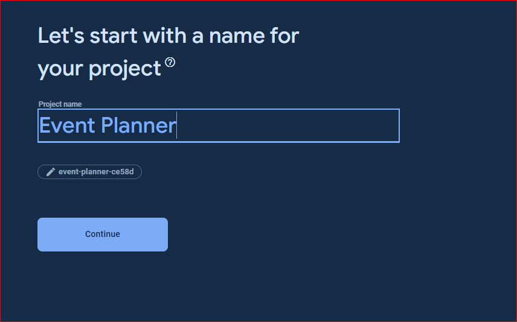

გათიშე google analytics ფუნქცია და დაასრულე პროექტის შექმნა continue ღილაკზე დაჭერით

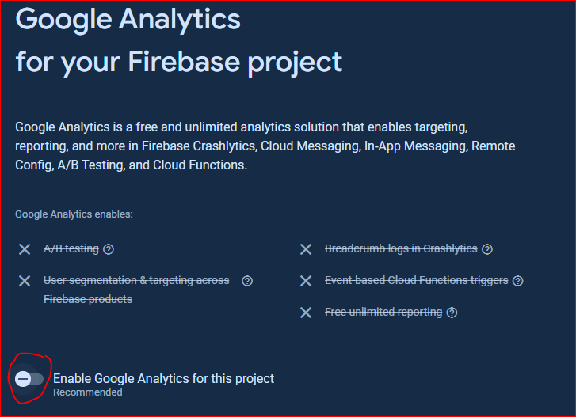

ახლა გვინდა, რომ შევქმნათ ორი აპლიკაცია ჩვენს firebase პროექტში.
 1. ვებ პროექტი - რადგანაც Flutlab ემულატორისთვის სწორედ ვებ პლათფორმას იყენებს
 2. ანდროიდ პროექტი - საბოლოო ჯამში ჩვენი მიზანი სწორედ ანდროიდ პლათფორმაა.

 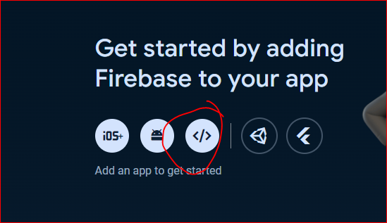

აირჩიე ვებ პროექტი, შეურჩიე სახელი, დაარეგისტრირე ვებ აპლიკაცია register app ღილაკის დახმარებით. დააჭირე ღილაკს continue to console

დაამატე ახალი აპლიკაცია:

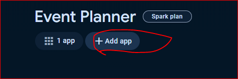

და აირჩიე ანდროიდი.

შეურჩიე შენს აპლიკაციას სახელი. ანდროიდის შემთხვევაში ვიყენებთ ეგრედ წოდებულ reverse domain name (შებრუნებული საიტის მისამართი). არ არის აუცილებელი ეს იყოს შენი საიტის მისამართი. თუმცა მნიშვნელოვანია რომ ეს იყოს უნიკალური მისამართი.

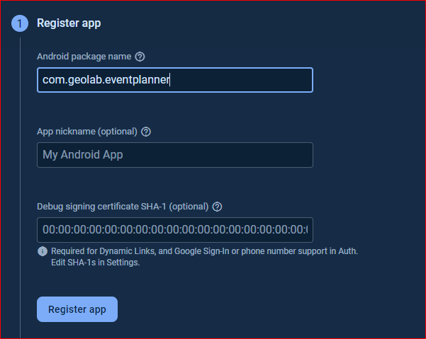. 

დააჭირე register app ღილაკს. შემდეგ Next -> Next -> contunue to console.

აპლიკაციები შესაბამისი პლათფორმებისათვის შევქმენით ახლა Flutlab_ის პროექტი უნდა დავაკავშიროთ ჩვენს firebase პროექტთან.

ამისათვის ზედა მენიუში აირჩიე Google Services

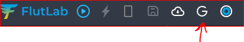

და შემდეგ Connect to firebase. 

გამოსულ ფანჯარაში, პირველ რიგში ავირჩიოთ ვებ პროექტი. შემდეგ ფანჯარაში უნდა ჩავაკოპიროთ CDN სკრიფტი. ამისთვის დაბრუნდი Firebase_ის პროექტში. გადადი პროექტის პარამეტრებში (project settings):

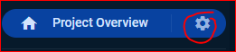

ქვემოთ აირჩიე web app და CDN Script

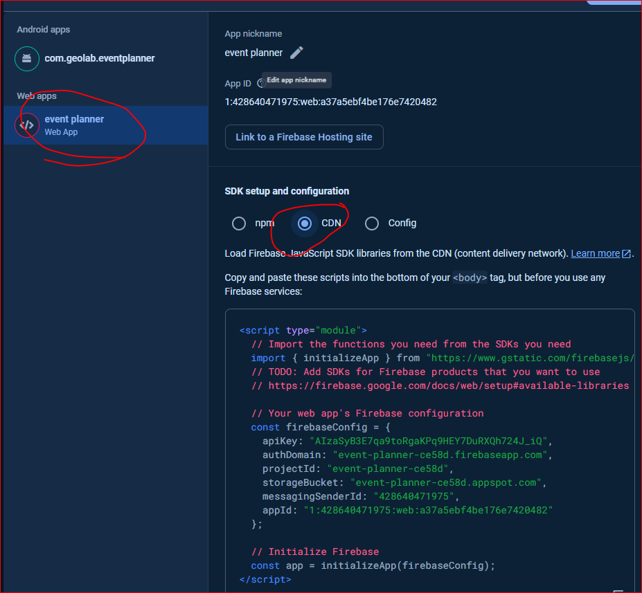 

დააკოპირე მოცემული სკრიფტი სრულად და გადაიტანე Flutlab_ში

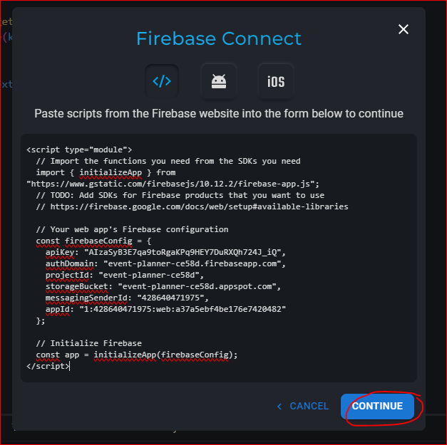

შემდეგ ფანჯარაში აირჩიე FireStore და Authentication სერვისები და დააჭირე connect ღილაკს

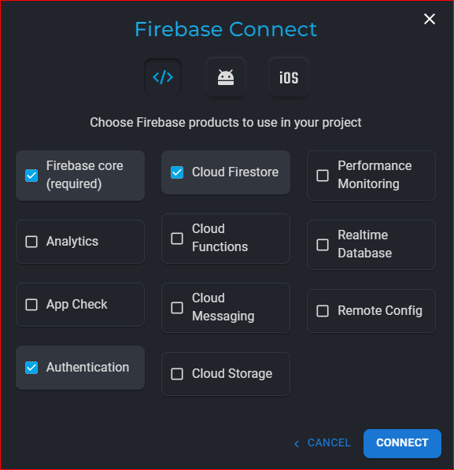


ახლა მსგავსი პროცესი უნდა გავიმეოროთ ანდროიდ პროექტისათვის. დაბრუნდი firebase პროექტის პარამეტრებში. აირჩიე ანროიდ აპლიკაცია და გადმოწერე google-services.json ფაილი.

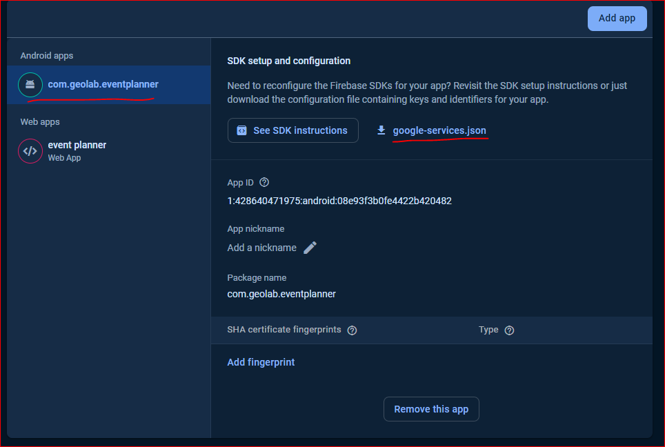

Flutlab_ში Google services > connect to firebase > android. ატვირთე google-services.json ფაილი.

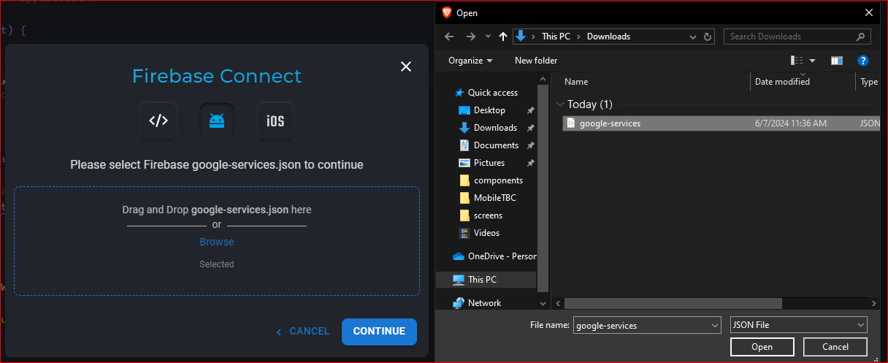

 შემდეგ ფანჯარაში კი ვირჩევთ Authentication და Cloud Firestore სერვისებს.

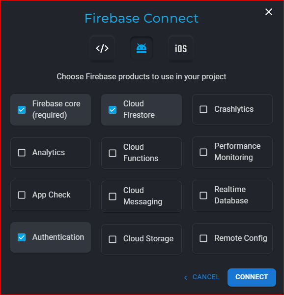

არ დაგავიწყდეს connect ღილაკზე დაჭერა.

ამის შემდეგ აღმოაჩენ, რომ შენს პროექტში ერორებია. ამის მიზეზი მარტივია, დაკავშირებისას flutlab ავტომატურად ამატებს Firebase_ის ბიბლიოთეკების უკანასკნელ ვერსიებს, რომლებიც არ არის თავსებადი იმ Flutter_ის ვერსიასთან, რომელსაც ვიყენებთ (Flutlab_ი შედარებით ძველ ვერსიაზე მუშაობს). ამ პრობლემის გამოსასწორებლად გადადი pubspec.yaml ფაილში და შეცვალე ბიბლიოთეკის ვერსიები შედარებით ძველით.

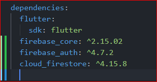

არ დაგავიწყდეს pub get ღილაკზე დაჭერა (ამ ღილაკზე დაჭრისას pubspec.yaml ფაილში მითითებული ბიბლიოთეკების გადმოწერა ხდება)

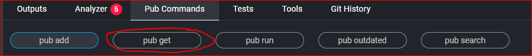

Firebase_თან დაკავშირება დავასრულეთ. მომავალში დამატებით დაგვჭირდება იმ სერვისების ჩართვა, რომლებსაც ვიყენებთ Firebase console_ში. 


## აუთენთიფიკაცია

ჩვენს აპლიკაციაში აუთენთიფიკაციის ფუნქციონალს login და register ეკრანზებზე გავანაწილებთ. აპლიკაციის გახსნისას მომხმარებელს საშვალება ექნება დარეგისტრირდეს, შემდეგ გაიაროს აუტორიზაცია და გადავიდეს home_screen_ზე.

დავიწყოთ აპლიკაციის მშენებლობა :)

main.dart ფაილი საწყის ეტაპზე ასე გამოიყურება:

```dart
import 'package:event_planner/screens/register_screen.dart';
import 'package:firebase_core/firebase_core.dart';
import 'package:flutter/material.dart';

import 'firebase_options.dart';

void main() async {
  WidgetsFlutterBinding.ensureInitialized();
  await Firebase.initializeApp(options: DefaultFirebaseOptions.currentPlatform);
  runApp(const MyApp());
}

class MyApp extends StatelessWidget {
  const MyApp({Key? key}) : super(key: key);

  @override
  Widget build(BuildContext context) {
    return MaterialApp(
      home: RegisterScreen(),
    );
  }
}

```

დაუკვირდი main ფუნქციას სადაც ჩვენ Firebase_ის ინიციალიზებას ვახდენთ. initializeApp მეთოდს გადავცემთ იმ პლათფორმის შესახებ ინფორმაციას, რომელზეც მომხმარებელი გახსნის ჩვენს აპლიკაციას.
არ დაგავიწყდეს import ინსტრუქციებიც. ამის გარდა ჯერჯერობით უბრალოდ რეგისტრაციის ეკრანს ვხსნით რომელიც ასე გამოიყურება:

```dart
import 'package:firebase_auth/firebase_auth.dart';
import 'package:flutter/material.dart';

import 'login_screen.dart';

class RegisterScreen extends StatelessWidget {
  RegisterScreen({Key? key}) : super(key: key);

  final TextEditingController emailController = TextEditingController();
  final TextEditingController passwordController = TextEditingController();
  final TextEditingController confirmController = TextEditingController();

  void registerUser(BuildContext context) {
    FirebaseAuth.instance
        .createUserWithEmailAndPassword(
      email: emailController.text,
      password: passwordController.text,
    )
        .then((creds) {
      if (creds.user != null) {
        if (creds.user!.emailVerified == false) {
          creds.user!.sendEmailVerification();
          ScaffoldMessenger.of(context)
              .showSnackBar(const SnackBar(content: Text('Check Mail')));
        }
      }
    });
  }

  @override
  Widget build(BuildContext context) {
    return Scaffold(
      appBar: AppBar(
        title: const Text('Sign Up'),
      ),
      body: Container(
        margin: const EdgeInsets.symmetric(
          horizontal: 24,
          vertical: 16,
        ),
        child: Column(
          children: [
            TextField(
              controller: emailController,
              decoration: InputDecoration(
                label: Text('Email'),
              ),
            ),
            const SizedBox(
              height: 16,
            ),
            TextField(
              controller: passwordController,
              decoration: InputDecoration(
                label: Text('Password'),
              ),
            ),
            const SizedBox(
              height: 16,
            ),
            TextField(
              controller: confirmController,
              decoration: InputDecoration(
                label: Text('ConfirmPassword'),
              ),
            ),
            Row(
              mainAxisAlignment: MainAxisAlignment.end,
              children: [
                TextButton(
                  onPressed: () {},
                  child: const Text('no account?'),
                )
              ],
            ),
            const SizedBox(
              height: 16,
            ),
            ElevatedButton(
              onPressed: () {
                registerUser(context);
              },
              child: const Text('Sign Up'),
            )
          ],
        ),
      ),
    );
  }
}


```

მსგავსი დიზაინის ეკრანი აქამდეც ბევრჯერ აგვიწყია. შედარებით უცხო ნაწილი registerUser ფუნქციაა რომელსაც ახლა გავარჩევთ.

```dart
void registerUser(BuildContext context) {
    FirebaseAuth.instance
        .createUserWithEmailAndPassword(
      email: emailController.text,
      password: passwordController.text,
    )
        .then((creds) {
      if (creds.user != null) {
        if (creds.user!.emailVerified == false) {
          creds.user!.sendEmailVerification();
          ScaffoldMessenger.of(context)
              .showSnackBar(const SnackBar(content: Text('Check Mail')));
        }
      }
    });
  }
```

ამ ფუნქციაში ჩვენ:
 - ფუნქცია პარამეტრის სახით იღებს BuildContext ტიპის ობიექტს.
 - FirebaseAuth ბიბლიოთეკიდან ვიღებთ ამავე სახელის კლასის ობიექტს FirebaseAuth.instance სინტაქსის დახმარებით.
 - FirebaseAuth ობიექტზე ვიძახებთ createUserWithEmailAndPassword მეთოდს და გადავცემთ მომხმარებლის იმეილსა და პაროლს.
 - createUserWithEmailAndPassword მეთოდი გვიბრუნებს Future ტიპის ობიექტს. ამიტომ შეგვიძლია გამოვიძახოთ then ფუნქცია, რომელშიც ვაწვდით ანონიმურ ფუნქციას.
 - ამ ანონიმურ ფუნქციას დარტი მაშინ გამოიძახებს, როდესაც Future ობიექტი 'დაასრულებს მუშაობას'.
 - ანონიმურ ფუნქციას დარტი ასევე პარამეტრის სახით გადმოაწვდის UserCredential ობიექტს, რომელშიც თუკი მომხმარებლის შექმნა წარმატებით დასრულდა დაგვიბრუნდება User ობიექტი.
 - ანონიმური ფუნქციის ტანში ვამოწმებთ, თუკი creds.user არ არის null_ი და მომხმარებლის მეილი არ არის ვერიფიცირებული. ამ შემთხვევაში მომხმარებელს ვუგზავნით ვერიფიცირების მეილს და SnackBar ვიჯეტის დახმარებით ეკრანზე ვუთითებთ, რომ შეამოწმოს იმეილი.

 ეს ფუნქცია მოდით Sign Up ღილაკზე დაჭერისას გამოვიძახოთ, თუმცა სანამ ფუნქციონალს გავტესტავდეთ, Firebase console_ში აუთენთკაციის სერვისი უნდა ჩავრთოთ.

 ```dart
    ElevatedButton(
        onPressed: () {
        registerUser(context);
        },
        child: const Text('Sign Up'),
    )
 ```

დაბრუნდი firebase console_ში და ეკრანის მარცხენა მხარეს build ტაბში გადადი Authentication გვერდზე

 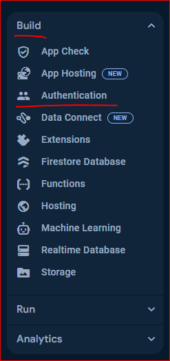

დააჭირე Get Started ღილაკს > Native providers ტაბში აირჩიე Email/Password. გამოსულ ფანჯარაში ჩართე ეს სერვისი enable ღილაკის დახმარებით და დააჭირე Save ღილაკს.

სერვისი გააქტიურებულია, შეგვიძლია ემულატორში გავტესტოთ მომხმარებლის რეგისტრაცია. შეიყვანე შენი მეილი და პაროლი (მინიმუმ 6 სიმბოლოიანი) და დააჭირე Sign Up ღილაკს. გამოჩნდება ჩვენს მიერ შექმნილი SnackBar ვიჯეტი მესიჯით Check Mail. ასევე მოგვივა ვერიფიცირების მეილი და Firebase console_ში Authentication გვერდზე, Users ტაბში დაემატება ახალი მომხმარებელი

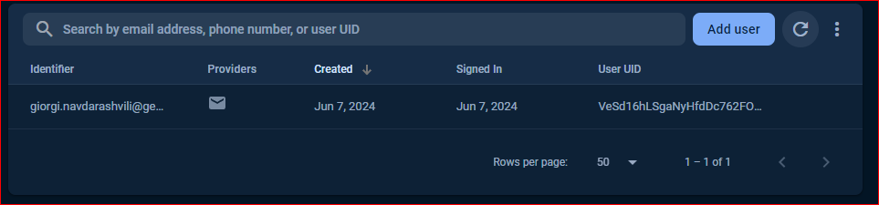

რეგისტრაციის პროცესი გავმართეთ, ახლა ავტორიზაციას (Log in) ფუნქციონალს მივხედოთ.
ჯერჯერობით LoginScreen_ზე რეგისტრაციის გვერდიდან გადავალთ. 'no account?' ღილაკზე დაჭერისას შევასრულოთ ნავიგაცია

```dart
TextButton(
    onPressed: () {
    Navigator.of(context).push(MaterialPageRoute(
        builder: (context) {
            return LoginScreen();
        },
    ));
    },
    child: const Text('no account?'),
)
```

Login_screen.dart ფაილი კი ასე გამოიყურება:

```dart
import 'package:firebase_auth/firebase_auth.dart';
import 'package:flutter/material.dart';

import 'register_screen.dart';

class LoginScreen extends StatelessWidget {
  LoginScreen({Key? key}) : super(key: key);

  final TextEditingController emailController = TextEditingController();
  final TextEditingController passwordController = TextEditingController();

  void loginUser(BuildContext context) {
    FirebaseAuth.instance
        .signInWithEmailAndPassword(
      email: emailController.text,
      password: passwordController.text,
    )
        .then((value) {
      if (value.user != null) {
        if (value.user!.emailVerified == false) {
          ScaffoldMessenger.of(context).showSnackBar(
            const SnackBar(
              content: Text('Please verify your email'),
            ),
          );
        }
      }
    });
  }

  @override
  Widget build(BuildContext context) {
    return Scaffold(
      appBar: AppBar(
        title: const Text('Log In '),
      ),
      body: Container(
        margin: const EdgeInsets.symmetric(horizontal: 16),
        child: Column(
          children: [
            const SizedBox(
              height: 32,
            ),
            const CircleAvatar(
              radius: 40,
              child: Icon(Icons.person, size: 40),
            ),
            const SizedBox(
              height: 16,
            ),
            TextField(
              controller: emailController,
              decoration: const InputDecoration(
                label: Text('Email'),
              ),
            ),
            const SizedBox(
              height: 16,
            ),
            TextField(
              controller: passwordController,
              decoration: const InputDecoration(
                label: Text('Password'),
              ),
            ),
            Row(
              mainAxisAlignment: MainAxisAlignment.end,
              children: [
                TextButton(
                    onPressed: () {
                      Navigator.of(context).pushReplacement(MaterialPageRoute(
                        builder: (context) {
                          return RegisterScreen();
                        },
                      ));
                    },
                    child: const Text(
                      'no account?',
                      style: TextStyle(
                        fontSize: 16,
                        decoration: TextDecoration.underline,
                      ),
                    ))
              ],
            ),
            const SizedBox(
              height: 48,
            ),
            ElevatedButton(
                onPressed: () {
                  loginUser(context);
                },
                child: const Text('Log In'))
          ],
        ),
      ),
    );
  }
}


```

მსგავსად რეგისტრაციის ეკრანისა, შედარებით უცხო loginUser ფუნქციაა, ამიტომ მოდით ეს ფუნქცია დეტალურად განვიხილოთ:

```dart
void loginUser(BuildContext context) {
    FirebaseAuth.instance
        .signInWithEmailAndPassword(
      email: emailController.text,
      password: passwordController.text,
    )
        .then((creds) {
      if (creds.user != null) {
        if (creds.user!.emailVerified == false) {
          ScaffoldMessenger.of(context).showSnackBar(
            const SnackBar(
              content: Text('Please verify your email'),
            ),
          );
        } else {
          Navigator.pushReplacement(context, MaterialPageRoute(
            builder: (context) {
              return HomeScreen();
            },
          ));
        }
      }
    });
  }
```

ამ ფუნქციაში ჩვენ:
 - ფუნქცია პარამეტრის სახით იღებს BuildContext ტიპის ობიექტს.
 - FirebaseAuth ბიბლიოთეკიდან ვიღებთ ამავე სახელის კლასის ობიექტს FirebaseAuth.instance სინტაქსის დახმარებით.
 - FirebaseAuth ობიექტზე ვიძახებთ signInWithEmailAndPassword მეთოდს და გადავცემთ მომხმარებლის იმეილსა და პაროლს.
 - signInWithEmailAndPassword მეთოდი გვიბრუნებს Future ტიპის ობიექტს. ამიტომ შეგვიძლია გამოვიძახოთ then ფუნქცია, რომელშიც ვაწვდით ანონიმურ ფუნქციას.
 - ამ ანონიმურ ფუნქციას დარტი მაშინ გამოიძახებს, როდესაც Future ობიექტი 'დაასრულებს მუშაობას'.
 - ანონიმურ ფუნქციას დარტი ასევე პარამეტრის სახით გადმოაწვდის UserCredential ობიექტს, რომელშიც თუკი მომხმარებლის შექმნა წარმატებით დასრულდა დაგვიბრუნდება User ობიექტი.
 - ანონიმური ფუნქციის ტანში ვამოწმებთ, თუკი creds.user არ არის null_ი და მომხმარებლის მეილი არ არის ვერიფიცირებული. ამ შემთხვევაში მომხმარებელს SnackBar ვიჯეტის დახმარებით ეკრანზე ვუთითებთ, რომ შეამოწმოს იმეილი.
 - თუ მომხმარებელს ვერიფიცირება გავლილი აქვს გადაგვყავს HomeScreen_ზე

 ამ ფუნქციის გამოძახების შემდეგ, თუკი მომხმარებელმა წარმატებით გაიარა აუტორიზაცია Firebase_ი შეინახავს მომხმარებლის შესახებ ინფორმაციას. ეს ინფორმაცია შეგვიძლია გამოვიყენოთ main.dart ფაილში, რათა მომხმარებელს ყოველ ჯერზე არ დასჭირდეს დალოგინება. თუ მომხარებელს გავლილი აქვს ავტორიზაცია მას პირდაპი HomeScreen_ზე გადავიყანთ. 

 main.dart ფაილი ასე გამოიყურება:

 ```dart
import 'package:event_planner/screens/home_screen.dart';
import 'package:event_planner/screens/register_screen.dart';
import 'package:firebase_auth/firebase_auth.dart';
import 'package:firebase_core/firebase_core.dart';
import 'package:flutter/material.dart';

import 'firebase_options.dart';
import 'screens/login_screen.dart';

void main() async {
  WidgetsFlutterBinding.ensureInitialized();
  await Firebase.initializeApp(options: DefaultFirebaseOptions.currentPlatform);
  runApp(const MyApp());
}

class MyApp extends StatelessWidget {
  const MyApp({Key? key}) : super(key: key);

  @override
  Widget build(BuildContext context) {
    return MaterialApp(
      theme: ThemeData(
        inputDecorationTheme: const InputDecorationTheme(
          border: OutlineInputBorder(),
        ),
      ),
      home: StreamBuilder<User?>(
          stream: FirebaseAuth.instance.authStateChanges(),
          builder: (context, snapshot) {
            if (snapshot.hasData && snapshot.data!.emailVerified) {
              return HomeScreen();
            }
            if (snapshot.connectionState == ConnectionState.waiting) {
              return const Center(child: CircularProgressIndicator());
            }
            return LoginScreen();
          }),
    );
  }
}

 ```
თუ დაუკვირდები აღმოაჩენ რომ MaterialApp_ის home პარამეტრში გვაქვს ახალი ტიპის ვიჯეტი StreamBuilder<User?>. ამ ვიჯეტის stream პარამეტრში ვაწოდებთ FirebaseAuth.instance.authStateChanges() მნიშნველობას. authStateChanges ფუნქცია აბრუნებს stream_ს. სტრიმში იმის მიხედვით თუ რას აკეთებს მომხმარებელი (დარეგისტრირდა, აუტორიზაცია გაიარა და ა.შ) შეგვიძლია ჩვენს აპლიკაციაში გამოვაჩინოთ განსხვავებული ეკრანი. 

ჩვენს შემთხვევაში აპლიკაციის გახსნისას, თუკი მომხმარებელს შექმნილი აქვს ექაუნთი და გავლილი აქვს ვერიფიკაცია გადაგვყავს HomeScreen ეკრანზე.

თუ მომხმარებელის შესახებ არ გაგვაჩნია არანაირი ინფორმაცია (მომხმარებელს არ აქვს გავლილი აუტორიზაცია) მომხმარებელს ვაჩვენებთ login ეკრანს. ხოლო თუკი უბრალოდ ველოდებით firebase_იდან ინფორმაციის წამოღებას მომხმარებელი დაინახავს loading ვიჯეტს.

## აქტივობების გვერდი

ახლა მოდით ჩვენი აპლიკაციის მთავარი ფუნქციონალზე დავიწყოთ მუშაობა. ამისათვის ჩვენ რამდენიმე რამის გაკეთება დაგვჭირდება:
- უნდა შევქმნათ მოდელი, რომლის დახმარებითაც აღვწერთ თუ როგორი უნდა იყოს აქტივობის ობიექტი
- შევქმნით HomeScreen ვიჯეტს სადაც მომხმარებელი ნახავს ყველა აქტივობის ჩამონათვალს.
- შევქმნით AddEventScreen ვიჯეტს სადაც მომხმარებელს შეეძლება ახალი აქტივობის დამატება.

მაგრამ პირველ რიგში მოდით Firebase console_ში გავააქტიუროთ Firestore მონაცემთა ბაზა. ამისთვის ეკრანის მარცხენა მხარეს build ტაბში, აირჩიე Firestore Database

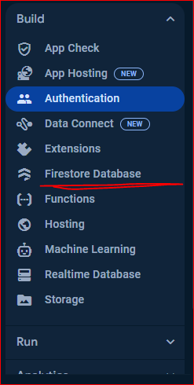

შემდეგ ფანჯარაში დააჭირე Get Started ღილაკს, შემდეგ აირჩიე რეგიონი და ბოლო ბანჯარაში დატოვე მონიშვნა (start in production mode) და დააჭირე create ღილაკს.

ამის შემდეგ გადადი Rules ტაბში და ჩააკოპირე შემდეგი კოდი:

```js
rules_version = '2';

service cloud.firestore {
  match /databases/{database}/documents {
    match /{document=**} {
      allow read, write: if request.auth != null;
    }
  }
}
```

და დააჭირე Publish ღილაკს. ამით ჩვენს FireStore_ის პორექტს ვეუბნებით, რომ მხოლოდ აუტორიზებულ მომხმარებელს მისცეს უფლება წაიკითხოს და ჩაწეროს ინფორმაცია.

ახლა პირველ რიგში მოდით შევქმნათ EventModel კლასი:

```dart
class EventModel implements Comparable<EventModel> {
  final String name;
  final String description;
  final DateTime date;

  EventModel({
    required this.name,
    required this.description,
    required this.date,
  });

  factory EventModel.fromJson(Map<String, dynamic> json) {
    return EventModel(
      name: json['name'],
      description: json['description'],
      date: DateTime.parse(json['date']),
    );
  }

  Map<String, dynamic> toJson() {
    return {
      'name': name,
      'description': description,
      'date': date.toIso8601String(),
    };
  }

  @override
  int compareTo(EventModel other) {
    return date.compareTo(other.date);
  }
}

```

გარდა კლასის ცვლადებისა და კონსტრუქტორისა, რომლის სინტაქსი ჩვენთვის ნაცნობია ამ კლაკში გვაქვს სამი უცხო ფუნქცია.

toJson ფუნქციას ჩვენ ვიყენებთ ჩვენი ობიექტების ისეთ მონაცემის ტიპად გადასაკეთებლად, რომელსაც Firestore database_ი ელოდება. ეს არის json ფორმატი. json გახლავთ სტანდარტული გზა რათა შევძლოთ სხვადასხვა ენებში დაწერილ პროგრამებს შორის მოვახდინოთ ინფორმაციის გაცვლა.

საპირისპირო საქმეს აკეთებს fromJson ფუნქცია რომელიც პარამეტრად მიიღებს json_ს და დაგვიბრუნებს dart_ის ობიექტს

რაც შეეხება compareTo მეთოდს. პირველ რიგში მიაქციე ყურადღება ფაილის დასაწყისში
implements Comparable\<EventModel\>  ინსტრუქციას. აქ ჩვენს კლასს ვეუბნებით, რომ გვჭირდება ამ ობიექტების ერთმანეთთან შედარება რათა მომავალში შევძლოთ სიაში ამ ობიექტების დალაგება. Comparable არის კლასი რომელშიც აღწერილია compareTo მეთოდი implements ქივორდის დახმარებით კი ჩვენს კლასს ვეუბნებით რომ compareTo მეთოდის ჩვენი საკუთარი ფუნქციონალით შეცვლა გვსურს. compareTo მეთოდში ჩვენ ვიძახებთ იგივე მეთოდს ოღონდ DateTime ობიექტში აღწერილს. აქედან შეგვიძლია მივხვდეთ, რომ DateTime კლასი ასევე აიმპლემენტირებს Comparable კლასს.

ახლა მოდით შევქმნბათ HomeScreen ვიჯეტი:

```dart
import 'package:cloud_firestore/cloud_firestore.dart';
import 'package:event_planner/screens/add_event_screen.dart';
import 'package:flutter/material.dart';

import '../models/event_model.dart';

class HomeScreen extends StatelessWidget {
  HomeScreen({Key? key}) : super(key: key);

  final firestore = FirebaseFirestore.instance;

  Stream<List<EventModel>> getEvents() {
    return firestore.collection('events').snapshots().map((snapshot) {
      return snapshot.docs
          .map((doc) => EventModel.fromJson(doc.data()))
          .toList();
    });
  }

  @override
  Widget build(BuildContext context) {
    return Scaffold(
      appBar: AppBar(title: Text('მიმდინარე აქტივობები')),
      floatingActionButton: FloatingActionButton.extended(
        onPressed: () {
          Navigator.of(context).push(MaterialPageRoute(
            builder: (context) {
              return AddEvenetScreen();
              // return AddEvenetScreen();
            },
          ));
        },
        label: Text('plan'),
        icon: Icon(Icons.add),
      ),
      body: StreamBuilder<List<EventModel>>(
          stream: getEvents(),
          builder: (context, snapshot) {
            if (snapshot.hasError) {
              return Center(child: Text(snapshot.error.toString()));
            }
            if (snapshot.hasData) {
              final events = snapshot.data!;
              return ListView.builder(
                itemBuilder: (context, index) {
                  final event = events[index];
                  return Text('${event.name}');
                },
                itemCount: events.length,
              );
            }
            return Center(child: CircularProgressIndicator());
          }),
    );
  }
}

```

ამ ვიჯეტში შენთვის ორი შედარებით უცხო სინტაქსი შეგხვდება.
1. getEvents მეთოდი - ამ მეთოდის დახმარებით FirebaseFirestore მონაცემთა ბაზიდან, ვკითხულობთ აქტივობების სიას. მიაქციე ყურადღება, რომ მეთოდი აბრუნებს Stream_ს. 
firestore.collection('events').snapshots() გვიბრუნებს events კოლექციაში არსებულ სიას. შემდეგ კი თითოეულ სიის ელემენტს გარდავქმნით dart ობიექტად (EventModel ტიპის) fromJson მეთდოის დახმარებით.
2. StreamBuilder - ვიჯეტს stream პარამეტრში გადავცემთ ჩვენი ფუნქციის getEvents გამოძახების შედეგს. შემდეგ კი builder პარამეტრში, იმის მიხედვით დაბრუნდა თუ არა რაიმე ინფორმაცია getEvents მეთოდიდან მომხმარებელს შესაბამის ინფორმაციას ვაჩვენებთ ეკრანზე. snapshot ობიექტს ორი საინტერესო ბულეან პარამეტრი აქვს: hasError და hasData. თუკი ერთერთი მათგანი არის true მეორე ყოველთვის false იქნება. ჯერჯერობით თითოეული აქტივობისათვის უბრალოდ მის სახელს ვაჩენთ ეკრანზე, თუმცა ეს მალე შეიცვლება.

მანამდე კი მოდით ახალი აქტივობის დამატების ეკრანი შევქმნათ:

```dart


import 'package:cloud_firestore/cloud_firestore.dart';

import 'package:flutter/material.dart';

import '../models/event_model.dart';

class AddEvenetScreen extends StatefulWidget {
  const AddEvenetScreen({Key? key}) : super(key: key);

  @override
  State<AddEvenetScreen> createState() => _AddEvenetScreenState();
}

class _AddEvenetScreenState extends State<AddEvenetScreen> {
  final firestore = FirebaseFirestore.instance;

  Future<void> addEvent(EventModel event) async {
    await firestore.collection('events').add(event.toJson());
  }

  final TextEditingController eventNameController = TextEditingController();

  final TextEditingController eventDescriptionController =
      TextEditingController();

  final TextEditingController eventDateController = TextEditingController();
  DateTime pickedDate = DateTime.now();


  void getDatePicker() async {
    DateTime? date = await showDatePicker(
      context: context,
      initialDate: DateTime.now(),
      firstDate: DateTime.now(),
      lastDate: DateTime(DateTime.now().year + 1),
    );

    if (date != null) {
      setState(() {
        eventDateController.text = '${date.day}/${date.month}${date.year}';
        pickedDate = date;
      });
    }
  }


  @override
  Widget build(BuildContext context) {
    return Scaffold(
      appBar: AppBar(
        title: const Text('Add Event'),
      ),
      body: Container(
        margin: const EdgeInsets.symmetric(horizontal: 24),
        child: Column(
          children: [
            const SizedBox(
              height: 16,
            ),
            TextField(
              controller: eventNameController,
              decoration: const InputDecoration(
                label: Text('event name'),
              ),
            ),
            const SizedBox(
              height: 16,
            ),
            TextField(
              controller: eventDescriptionController,
              decoration: const InputDecoration(
                label: Text('event description'),
              ),
            ),
            const SizedBox(
              height: 16,
            ),
            TextField(
              controller: eventDateController,
              readOnly: true,
              decoration: const InputDecoration(
                label: Text('event date'),
              ),
              onTap: () {
                getDatePicker();
              },
            ),
            ElevatedButton(
              onPressed: () {
                addEvent(
                  EventModel(
                    name: eventNameController.text,
                    description: eventDescriptionController.text,
                    date: pickedDate,
                  ),
                );
                Navigator.pop(context);
              },
              child: const Text('Add Event'),
            )
            
          ],
        ),
      ),
    );
  }
}

```

AddEvenetScreen ვიჯეტი შედარებით მარტივია, თუმცა მაინც გვაქვს რამდენიმე ფუნქციონალი, რომლის განხილვაა საჭირო.

1. ეკრანის ბოლო TextField ვიჯეტში რამდენიმე ახალი პარამეტრი დაგვჭირდა:
 - readOnly პარამეტრის დახმარებით TextField ვიჯეტში კლავიატურის დახმარებით მომხმარებელს აღარ შეუძლია ინფორმაციის შეყვანა.
 - onTap პარამეტრში (მაშინ როცა მომხმარებელი ამ TextField ვიჯეტს დააჭერს) ვიძახებთ getDatePicker ფუნქციას
2. getDatePicker ფუნქციაში ვიძახებთ Flutter_ის showDatePicker მეთოდს, რომლის დახმარებით ეკრანზე გამოვა DatePicker ვიჯეტი. ამ ფუნქციას ოთხი პარამეტრი აქვს
 - context
 - initialDate - გადავცემთ იმ თარიღს რომელიც DatePicker ვიჯეტი გახსნის მომენტში იქნება
 - firstDate - გადავცემთ იმ თარიღს, რომელიც მომხმარებელს შეუძლია აირჩიოს აქტივობის დასაგეგმად (იმ დღეს როცა მომხმარებელი შექმნის აქტივობას)
 - lastDate - ყველაზე ბოლო თარიღს, როდესაც მომხმარებელს აქტივობის დაგეგმვა შეუძლია

 ასევე გვაქვს addEvent ფუნქცია, რომელსაც ახალი აქტივობის Firestore მონაცემთა ბაზაში შესანახად ვიძახებთ.

 აპლიკაციას თუ კი გატესტავ აღმოაჩენ რომ უკვე შეგიძლია ახალი აქტივობის დაგეგმვა.
 ხოლო HomeScreen ვიჯეტში გვიჩანს ამ აქტივობების სახელები.

 ახლა მოდით აქტივობისათვის კომპონენტების ფოლდერში შევქმნათ ვიჯეტი, რომელიც პასუხმგებელი იქნება აქტივობის სრული (ამ ეტაპზე) ინფორმაციის გამოჩენაზე.

 ```dart
import 'package:event_planner/models/event_model.dart';
import 'package:flutter/material.dart';

class EventsItem extends StatelessWidget {
  const EventsItem({
    super.key,
    required this.event,
  });

  final EventModel event;

  @override
  Widget build(BuildContext context) {
    return Card(
        child: Row(
      children: [
        Container(
          margin: const EdgeInsets.all(16),
          child: Column(
            crossAxisAlignment: CrossAxisAlignment.start,
            children: [
              Text(
                event.name,
                style:
                    const TextStyle(fontSize: 20, fontWeight: FontWeight.bold),
              ),
              const SizedBox(
                height: 8,
              ),
              Text(event.description),
              const SizedBox(
                height: 8,
              ),
              Text(event.date.toString().split(' ').first)
            ],
          ),
        ),
      ],
    ));
  }
}

 ```

 გამოიძახე ეს ვიჯეტი HomeScreen_ში Text ვიჯეტის მაგივრად და გადააწოდე event_ი

```dart

return ListView.builder(
  itemBuilder: (context, index) {
    final event = events[index];
    return EventsItem(
      event: event,
    );
  },
  itemCount: events.length,
);

```

## Firebase Storage

უკვე მზად ვართ შემოვიტანოთ ჩვენს პროექტში სურათების გაზიარების ფუნქციონალიც. ამისათვის Firebase Storage სერვისს გამოვიყენებთ. პირველ რიგში გადადი Firebase console_ში და დაამატე Firebase Storage სერვისი build ფანჯრიდან. ამ სერვისის შექმნის პროცესი იდენტურია Firebase Firestore მონაცემთა ბაზის შექმნისა. არ დაგავიწყდეს Rules ტაბში მხოლოდ აუტორიზებულ მომხმარებელს მისცე ინფორმაციის წაკითხვისა და ჩაწერის უფლება.

```js
  allow read, write: if request.auth != null;
```

ჩვენს აპლიკაციაში მომხმარებელს სურათის შემოტანა ორნაირად შეეძლება.
- ტელეფონიდან უკვე გადაღებული სურათის დამატება.
- კამერის აპლიკაციის დახმარებით ახალი სურათის გადაღება.

პირველ რიგში გადადი pubspec.yaml ფაილში და დაამატე ახალი ბიბლიოთეკები

```yaml
  firebase_core: ^2.15.0
  firebase_auth: ^4.6.3
  cloud_firestore: ^4.15.8
  firebase_storage: ^11.2.6
  camera: ^0.10.1
  file_picker: ^5.3.0
```

სამი ახალი ბიბლიოთეკა გვაქვს (თავსებადი ვერსიებით):
 1. firebase_storage - საშვალებას გვაძლევს შევინახოთ და წავიკითხოთ ფაილები
 2. camera - საშვალებას გვაძლევს გადავიღოთ სურათი
 3. file_picker - საშვალებას გვაძლევს მოწყობილობის მახსოვრობიდან წავიკითხოთ ფაილები.

 !!! არ დაგავიწყდეს pub get ღილაკის გამოყენება.

ახლა მოდით EventModel კლასი გადავაკეთოთ:

```dart
class EventModel implements Comparable<EventModel> {
  final String name;
  final String description;
  final DateTime date;
  final String imageUrl;

  EventModel({
    required this.name,
    required this.description,
    required this.date,
    required this.imageUrl,
  });

  factory EventModel.fromJson(Map<String, dynamic> json) {
    return EventModel(
        name: json['name'],
        description: json['description'],
        date: DateTime.parse(json['date']),
        imageUrl: json['imageUrl']);
  }

  Map<String, dynamic> toJson() {
    return {
      'name': name,
      'description': description,
      'date': date.toIso8601String(),
      'imageUrl': imageUrl
    };
  }

  @override
  int compareTo(EventModel other) {
    return date.compareTo(other.date);
  }
}


```

როგორც ხედავ უბრალოდ ახალი პარამეტრი imageUrl დავამატეთ EventModel კლასს.

ახლა უკვე შეგვიძლია ახალი აქტივობის დამატების ეკრანზეც ვიზრუნოთ. ჯერჯერობით მომხმარებელს მხოლოდ ფაილებიდან შეეძლება სურათის დამატება. მომავალში კი კამერის ფუნქციონალსაც შემოვიტანთ.

```dart
import 'dart:io';

import 'package:cloud_firestore/cloud_firestore.dart';
import 'package:file_picker/file_picker.dart';
import 'package:firebase_storage/firebase_storage.dart';
import 'package:flutter/material.dart';
import 'package:flutter/foundation.dart';

import '../models/event_model.dart';

class AddEvenetScreen extends StatefulWidget {
  const AddEvenetScreen({Key? key}) : super(key: key);

  @override
  State<AddEvenetScreen> createState() => _AddEvenetScreenState();
}

class _AddEvenetScreenState extends State<AddEvenetScreen> {
  final firestore = FirebaseFirestore.instance;

  Future<void> addEvent(EventModel event) async {
    await firestore.collection('events').add(event.toJson());
  }

  final TextEditingController eventNameController = TextEditingController();

  final TextEditingController eventDescriptionController =
      TextEditingController();

  final TextEditingController eventDateController = TextEditingController();

  DateTime pickedDate = DateTime.now();
  Uint8List? bytes;
  String? imageUrl;

  void getDatePicker() async {
    DateTime? date = await showDatePicker(
      context: context,
      initialDate: DateTime.now(),
      firstDate: DateTime.now(),
      lastDate: DateTime(DateTime.now().year + 1),
    );

    if (date != null) {
      setState(() {
        eventDateController.text = '${date.day}/${date.month}${date.year}';
        pickedDate = date;
      });
    }
  }


  void handleFilePick() async {
    FilePickerResult? result = await FilePicker.platform.pickFiles(
      allowMultiple: false,
      type: FileType.image,
    );
    if (result != null) {
      if (kIsWeb) {
        setState(() {
          bytes = result.files.first.bytes;
        });
      } else {
        String? filePath = result.files.first.path;
        if (filePath != null) {
          Uint8List fileBytes = await File(filePath).readAsBytes();
          setState(() {
            bytes = fileBytes;
          });
        }
      }
    } else {
      print('Something went wrong');
    }
  }

  Future<void> uploadImage() async {
    final storageRef =
        FirebaseStorage.instance.ref().child(DateTime.now().toString());
    if (bytes != null) {
      UploadTask uploadTask = storageRef.putData(bytes!);

      await uploadTask;

      imageUrl = await storageRef.getDownloadURL();
    }
    return;
  }

  @override
  Widget build(BuildContext context) {
    return Scaffold(
      appBar: AppBar(
        title: const Text('Add Event'),
      ),
      body: Container(
        margin: const EdgeInsets.symmetric(horizontal: 24),
        child: Column(
          children: [
            const SizedBox(
              height: 16,
            ),
            TextField(
              controller: eventNameController,
              decoration: const InputDecoration(
                label: Text('event name'),
              ),
            ),
            const SizedBox(
              height: 16,
            ),
            TextField(
              controller: eventDescriptionController,
              decoration: const InputDecoration(
                label: Text('event description'),
              ),
            ),
            const SizedBox(
              height: 16,
            ),
            TextField(
              controller: eventDateController,
              readOnly: true,
              decoration: const InputDecoration(
                label: Text('event date'),
              ),
              onTap: () {
                getDatePicker();
              },
            ),
            const SizedBox(
              height: 16,
            ),
            bytes == null
                ? Container(
                    width: 200,
                    height: 200,
                    color: Colors.cyan,
                    child: Icon(
                      Icons.image,
                      size: 84,
                      color: Colors.white,
                    ),
                  )
                : SizedBox(
                    width: 200, height: 200, child: Image.memory(bytes!)),
            const SizedBox(
              height: 16,
            ),
            Row(
              mainAxisAlignment: MainAxisAlignment.spaceBetween,
              children: [
                ElevatedButton(
                  onPressed: () {},
                  child: const Text('Capture'),
                ),
                ElevatedButton(
                  onPressed: handleFilePick,
                  child: const Text('Pick From files'),
                ),
              ],
            ),
            const SizedBox(
              height: 16,
            ),
            ElevatedButton(
              onPressed: () {
                addEvent(
                  EventModel(
                    name: eventNameController.text,
                    description: eventDescriptionController.text,
                    date: pickedDate,
                    imageUrl: imageUrl ?? '',
                  ),
                );
                Navigator.pop(context);
              },
              child: const Text('Add Event'),
            )
          ],
        ),
      ),
    );
  }
}

```

ამ ეკრანზე საკმაოდ ბევრი სიახლე გვაქვს:
1. შევქმენით ორი ცვლადი 
```dart
  Uint8List? bytes;
  String? imageUrl;
```
  bytes ცვლადში შევინახავთ სურათს Uint8List არის 0 - 255 ინტეჯერების სია, რომელშიც სურათის შემთხვევაში, პიქსელებზე ინფორმაციის შენახვა შეგვიძლია

  imageUrl ში კი შევინახავთ Firebase Storage _ში ატვირთული სურათის ინტერნეტ მისამართს.
2. დავამატეთ handleFilePick ფუნქცია:
```dart
  void handleFilePick() async {
    FilePickerResult? result = await FilePicker.platform.pickFiles(
      allowMultiple: false,
      type: FileType.image,
    );
    if (result != null) {
      if (kIsWeb) {
        setState(() {
          bytes = result.files.first.bytes;
        });
      } else {
        String? filePath = result.files.first.path;
        if (filePath != null) {
          Uint8List fileBytes = await File(filePath).readAsBytes();
          setState(() {
            bytes = fileBytes;
          });
        }
      }
    } else {
      print('Something went wrong');
    }
  }
```

ამ ფუნქციაში result ცვლადში, რომელიც FilePickerResult ტიპისაა შევინახავთ ფაილს, რომელსაც მომხმარებელი აირჩევს.

თუ result ცვლადის მნიშვნელობა არ არის null (მომხმარებელმა აირჩია სურათი)
და თუ კი პლათფორმა არის web (kIsWeb პარამეტრი გვიბრუნებს boolean მნიშვნელობას)bytes ცვლადში ვინახავთ ფაილს მისი ბაიტების სიის სახით. წინააღმდეგ შემთხვევაში (თუ პლატფორმა არის android) გვიწევს ფაილის ბაიტების სიის ჩვენით შექმნა File კლასის გამოყენებით dart.io ფაილიდან და ბაიტების მიღებულ სიას ასევე ვინახავთ bytes ცვლადში

არ დაგავიწყდეს შესაბამისი ფაილების დაიმპორტება.

ასევე შევქმენით uploadImage ფუნქცია:

```dart
Future<void> uploadImage() async {
    final storageRef =
        FirebaseStorage.instance.ref().child(DateTime.now().toString());
    if (bytes != null) {
      UploadTask uploadTask = storageRef.putData(bytes!);

      await uploadTask;

      imageUrl = await storageRef.getDownloadURL();
    }
    return;
  }
```

პირველ რიგში ვქმნით ფაილის 'რეფერენსს' ref ფუნქციის გამოყენებით და ფაილს სახელად ვარქმევთ მიმდინარე თარიღს. შემდეგ თუ bytes ცვლადი (ბაიტების სია) არ არის null ვქმნით UploadTask ტიპის ცვლადს და ვცდილობთ სურათის ატვირთვას.
ბოლოს კი imageUrl ცვლადში ვინახავთ ამ ფაილის მისამართს.

და ბოლოს გვაქვს რამდენიმე ცვლილება build მეთოდშიც:

```dart
@override
  Widget build(BuildContext context) {
    return Scaffold(
      appBar: AppBar(
        title: const Text('Add Event'),
      ),
      body: Container(
        margin: const EdgeInsets.symmetric(horizontal: 24),
        child: Column(
          children: [
            const SizedBox(
              height: 16,
            ),
            TextField(
              controller: eventNameController,
              decoration: const InputDecoration(
                label: Text('event name'),
              ),
            ),
            const SizedBox(
              height: 16,
            ),
            TextField(
              controller: eventDescriptionController,
              decoration: const InputDecoration(
                label: Text('event description'),
              ),
            ),
            const SizedBox(
              height: 16,
            ),
            TextField(
              controller: eventDateController,
              readOnly: true,
              decoration: const InputDecoration(
                label: Text('event date'),
              ),
              onTap: () {
                getDatePicker(context);
              },
            ),
            const SizedBox(
              height: 16,
            ),
            bytes == null
                ? Container(
                    width: 200,
                    height: 200,
                    color: Colors.cyan,
                    child: const Icon(
                      Icons.image,
                      size: 84,
                      color: Colors.white,
                    ),
                  )
                : SizedBox(
                    width: 200, height: 200, child: Image.memory(bytes!)),
            const SizedBox(
              height: 16,
            ),
            Row(
              mainAxisAlignment: MainAxisAlignment.spaceBetween,
              children: [
                ElevatedButton(
                  onPressed: () {},
                  child: const Text('Capture'),
                ),
                ElevatedButton(
                  onPressed: handleFilePick,
                  child: const Text('Pick From files'),
                ),
              ],
            ),
            const SizedBox(
              height: 16,
            ),
            ElevatedButton(
              onPressed: () {
                uploadImage().then((_) {
                  addEvent(
                    EventModel(
                      name: eventNameController.text,
                      description: eventDescriptionController.text,
                      date: pickedDate,
                      imageUrl: imageUrl ?? '',
                    ),
                  );
                  Navigator.pop(context);
                });
              },
              child: const Text('Add Event'),
            )
          ],
        ),
      ),
    );
  }
```

დავამატეთ ორი ღილაკი სურათის ფაილებიდან და კამერის დახმარებით წამოსაღებად.

ხოლო Add Event ღილაკზე დაჭერისას ვიძახებთ uploadImage ფუნქციას, რომლის დასრულების შემდეგ ვამატებთ ახალ ივენთს და ბოლოს გამოვდივართ წინა გვერდზე.

ახლა უკვე შეგვიძლია კამერის ფუნქციონალზეც ვიზრუნოთ.

პირველ რიგში დაამატე porviders ფოლდერი შენს პროექტში და მასში შექმენი camera_provider.dart ფაილი.
```dart
import 'package:camera/camera.dart';
import 'package:flutter/material.dart';

class CameraProvider extends ChangeNotifier {
  final List<CameraDescription> cameras;

  CameraProvider({required this.cameras});
}

```
CameraProvider კლასი საკმაოდ მარტივია გვაქვს CameraDescription ელემენტების სია, რომელსაც კლასის კონსტრუქტორში ვითხოვთ. (CameraDescription ობიექტი შეიცავს მოწყობილობის კამერების შესახებ ინფორმაციას)

ახლა გადავინაცვლოთ main.dart ფაილში და main ფუნქციაში რამდენიმე ცვლილება შევიტანოთ:

```dart
void main() async {
  WidgetsFlutterBinding.ensureInitialized();
  await Firebase.initializeApp(options: DefaultFirebaseOptions.currentPlatform);
  final cameras = await availableCameras();

  runApp(MultiProvider(
    providers: [
      ChangeNotifierProvider(create: (_) {
        return CameraProvider(cameras: cameras);
      }),
    ],
    child: const MyApp(),
  ));
}
```
availableCameras ფუნქციის დახმარებით მოგვაქვს სია მოწყობილობაში ხელმისაწვდომი კამერების შესახებ.

MyApp ვიჯეტს ვსვავთ MultiProvider ვიჯეტში (მომავალში ერთზე მეტი provider_ი დაგვჭირდება)
providers პარამეტრში ვქმნით CameraProvider ობიექტს, ხოლო child პარამეტრში ვიძახებთ ჩვენს MyApp ვიჯეტს.

ამის შემდეგ CameraProvider ობიექტი ხელმისაწვდომი იქნება ჩვენი აპლიკაციის მაშტაბით.

შემდეგ AddEvenetScreen ვიჯეტში დაამატე handleCapture მეთოდი:

```dart
Future<void> handleCapture(CameraController controller) async {
    controller.takePicture().then((XFile file) {
      return file.readAsBytes();
    }).then((value) {
      setState(() {
        bytes = value;
      });
    });
  }
```

ამ ფუნქციაში CameraController ობიექტზე, რომელსაც პარამეტში მივიღებთ, ვიძახებთ takePicture ფუნქციას, სურათის გადაღების შემდეგ გვიბრუნდება XFile ობიექტი რომელსაც Uint8List_ად გარდავქმნით readAsBytes ფუნქციის დახმარებით. ბოლოს კი bytes ცვლადში ვინახავთ ბაიტების სიას.

ამ მეთოდს ჩვენ გადავაწოდებთ CameraPreviewScreen, რომელსაც შემდგომში შევქმნით

```dart
ElevatedButton(
  onPressed: () {
    Navigator.of(context).push(MaterialPageRoute(
      builder: (context) => CameraPreviewScreen(
        handleCapture: handleCapture,
      ),
    ));
  },
  child: const Text('Capture'),
),
```

ახლა მოდით შევქმნათ camera_preview_screen.dart ფაილი და მასში CameraPreviewScreen ვიჯეტი.

```dart
import 'package:camera/camera.dart';
import 'package:event_planner/providers/camera_provider.dart';
import 'package:flutter/material.dart';
import 'package:provider/provider.dart';

class CameraPreviewScreen extends StatefulWidget {
  const CameraPreviewScreen({super.key, required this.handleCapture});

  final Future<void> Function(CameraController controller) handleCapture;

  @override
  State<CameraPreviewScreen> createState() => _CameraPreviewScreenState();
}

class _CameraPreviewScreenState extends State<CameraPreviewScreen> {
  late CameraController controller;

  @override
  void initState() {
    super.initState();
    final cameraProvider = Provider.of<CameraProvider>(context, listen: false);

    controller = CameraController(
      cameraProvider.cameras[0],
      ResolutionPreset.max,
      enableAudio: false,
    );
    controller.initialize().then((_) {
      if (!mounted) {
        return;
      }
      setState(() {});
    });
  }

  @override
  void dispose() {
    controller.dispose();
    super.dispose();
  }

  @override
  Widget build(BuildContext context) {
    if (controller.value.isInitialized) {
      return CameraPreview(
        controller,
        child: Stack(
          children: [
            Positioned(
              bottom: 48,
              left: 0,
              right: 0,
              child: IconButton(
                onPressed: () {
                  widget.handleCapture(controller).then((_) {
                    Navigator.of(context).pop();
                  });
                },
                icon: const Icon(
                  Icons.camera,
                  size: 60,
                ),
              ),
            )
          ],
        ),
      );
    } else {
      return const Scaffold(
        body: CircularProgressIndicator(),
      );
    }
  }
}

```

ვიჯეტის დასაწყისში ვქმნით CameraController ტიპის ცვლადს

```dart
late CameraController controller;
```

late ქივორდი დარტს ეუბნება, რომ ამ ცვლადის გამოყენებისას მას მნიშვნელობა აუცილებლად ექნება

შემდეგ გქვაქვს initState მეთოდი:

```dart
@override
  void initState() {
    super.initState();
    final cameraProvider = Provider.of<CameraProvider>(context, listen: false);

    controller = CameraController(
      cameraProvider.cameras[0],
      ResolutionPreset.max,
      enableAudio: false,
    );
    controller.initialize().then((_) {
      if (!mounted) {
        return;
      }
      setState(() {});
    });
  }
```
ამ მეთოდს State კლასიდან ვიღებთ და Flutter მას ვიჯეტის შექმნის წინ გამოიძახებს.
cameraProvider ცვლადში ვინახავთ ჩვენს CameraProvider ობიექტს. შემდეგ ვქმნით CameraController ობიექტს და ვინახავთ მას controller ცვლადში. CameraController_ს სამ პარამეტრს გადავცემთ:
1. cameraProvider.cameras[0] კამერების სიიდან გვინდა პირველი კამერა (რომელიც ყოველთვის უკანა, მთავარი კამერაა).
2. ResolutionPreset.max ვუთითებთ, რომ საუკეთესო ხარისხის სურათი გვინდა.
3. enableAudio: false ვუთითებთ რომ არ გვჭირდება მიკროფონის ფუნქციონალი.

შემდეგ ვაინიციალიზირებთ controller ობიექტს, რის შემდეგაც ვიძახებთ ცარიელ setState ფუნქციას, რაც ვიჯეტს თავიდან დახატავს. (ვიჯეტში გვჭირდება, რომ controller ობიექტი არ იყოს null)

build მეთოდში ვამოწმებთ, თუ კამერის კონტროლერი ინიციალიზირებულია ვხატავთ CameraPreview ვიჯეტს, წინააღმდეგ შემთხვევაში CircularProgressIndicator ვიჯტეს.

```dart
@override
  Widget build(BuildContext context) {
    if (controller.value.isInitialized) {
      return CameraPreview(
        controller,
        child: Stack(
          children: [
            Positioned(
              bottom: 48,
              left: 0,
              right: 0,
              child: IconButton(
                onPressed: () {
                  widget.handleCapture(controller).then((_) {
                    Navigator.of(context).pop();
                  });
                },
                icon: const Icon(
                  Icons.camera,
                  size: 60,
                ),
              ),
            )
          ],
        ),
      );
    } else {
      return const Scaffold(
        body: CircularProgressIndicator(),
      );
    }
  }
```

CameraPreview ვიჯეტს ვაწვდით კონტროლერს, child პარამეტრში კი ვიყენებთ Stack ვიჯეტს. 

Stack ვიჯეტის დახმარებით, შეგვიძლია სხვადასხვა ვიჯეტები ერთმანეთზე დავხატოთ. ჩვენს შემთხვევაში camera იქონს ვხატავთ ეკრანის ქვემოთ, ცენტრში Positioned ვიჯეტის გამოყენებით. ამ იქონზე დაჭერისას კი ვიძახებთ handleCapture მეთოდს რომელიც კონსტრუქტორში მოვითხოვეთ და გადავცემთ კამერის კონტროლერს. სურათის გადაღების შემდეგ pop ფუნქციის დახმარებით ვბრუნდებით უკან.